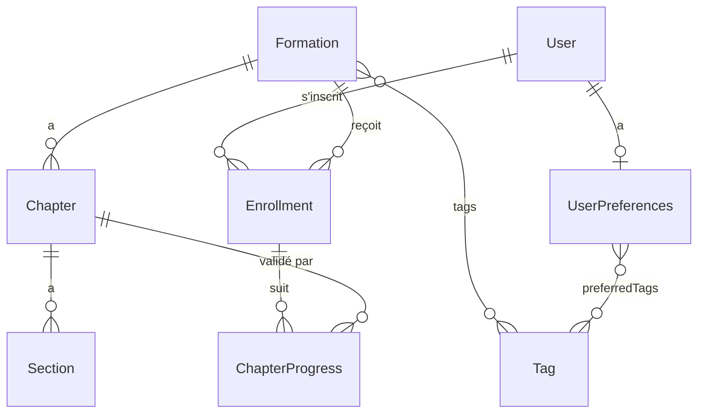

# Modèle de données

> **Statut** — Reconstruit à partir des issues GitHub (le « plan » d'origine n'avait pas été
> consigné dans le dépôt). Les éléments marqués _(à confirmer)_ sont des choix d'implémentation
> raisonnables non figés par une issue : à trancher au moment de coder l'entité.
>
> **Sources** : issues [#7](https://github.com/CallMeTrinity/formations/issues/7) (contenu),
> [#8](https://github.com/CallMeTrinity/formations/issues/8)/[#9](https://github.com/CallMeTrinity/formations/issues/9) (parsing + sync),
> [#11](https://github.com/CallMeTrinity/formations/issues/11) (User),
> [#14](https://github.com/CallMeTrinity/formations/issues/14) (préférences),
> [#18](https://github.com/CallMeTrinity/formations/issues/18)/[#28](https://github.com/CallMeTrinity/formations/issues/28) (visibilité),
> [#19](https://github.com/CallMeTrinity/formations/issues/19) (progression).

## Vue d'ensemble

Le contenu pédagogique est écrit en **markdown** dans les dossiers de formation du dépôt parent.
La commande `app:formations:sync` (#9) l'importe en base. Le suivi utilisateur et les métadonnées
d'administration vivent uniquement en base et **ne sont jamais écrasés par la sync**.

On distingue trois groupes d'entités :

- **Contenu** — `Formation`, `Chapter`, `Section`, `Tag` (issue #7).
- **Comptes & préférences** — `User`, `UserPreferences` (issues #11, #14).
- **Progression** — `Enrollment`, `ChapterProgress` (issue #19).

## Énumérations

### `Visibility` (#18, #28)

Contrôle l'accès à une formation. Effet immédiat via le `FormationVoter` et le filtrage repository.

| Valeur     | Qui y accède           |
|------------|------------------------|
| `DRAFT`    | Admin uniquement       |
| `BETA`     | Tout utilisateur connecté |
| `RELEASED` | Tout le monde (public) |

### `Difficulty` _(à confirmer)_

Niveau d'une formation, et préférence de niveau côté utilisateur (#14, #29).

| Valeur         |
|----------------|
| `BEGINNER`     |
| `INTERMEDIATE` |
| `ADVANCED`     |

### `SectionType` (#8)

Type d'une section de chapitre, déduit du titre `##` par le `ChapterParser`.

| Valeur       | Titre markdown source (indicatif) |
|--------------|-----------------------------------|
| `OBJECTIVES` | Objectifs                         |
| `SUMMARY`    | Résumé                            |
| `EXERCISES`  | Exercices                         |
| `QUIZ`       | Quiz                              |
| `PROJECT`    | Projet                            |
| `CONTENT`    | Corps de texte par défaut _(à confirmer)_ |

## Entités de contenu (#7)

### `Formation`

Une formation = un dossier markdown du dépôt parent. La sync fait un **upsert par `slug`**.

| Champ            | Type                | Origine | Notes |
|------------------|---------------------|---------|-------|
| `id`             | int                 | —       | PK    |
| `slug`           | string, **unique**  | sync    | Clé d'upsert (nom du dossier) |
| `title`          | string              | sync    | Depuis le `README` de la formation |
| `description`    | text                | sync    | |
| `status`         | string _(à confirmer)_ | sync | Statut éditorial issu des consignes (brouillon/terminée) — distinct de `visibility` |
| `chapters`       | OneToMany `Chapter` | sync    | Ordonnés par `position` |
| `visibility`     | `Visibility`        | **admin** | Préservé par la sync |
| `difficulty`     | `Difficulty`        | **admin** | Préservé par la sync (#29) |
| `tags`           | ManyToMany `Tag`    | **admin** | Préservé par la sync (#29) |
| `estimatedMinutes` | int               | **admin** | Préservé par la sync (#29) |
| `createdAt` / `updatedAt` | datetime   | —       | _(à confirmer)_ |

> **Invariant de sync (#9)** — `app:formations:sync` réécrit uniquement les champs **contenu**
> (`title`, `description`, `chapters`, `sections`…). Les champs **admin** (`visibility`,
> `difficulty`, `tags`, `estimatedMinutes`) ne sont jamais touchés. La commande est idempotente :
> la relancer ne duplique rien et préserve les réglages.

### `Chapter`

| Champ        | Type                 | Notes |
|--------------|----------------------|-------|
| `id`         | int                  | PK |
| `formation`  | ManyToOne `Formation`| |
| `position`   | int                  | Préfixe `NN-` du fichier `NN-slug.md` |
| `slug`       | string               | Unique par formation _(à confirmer)_ |
| `title`      | string               | |
| `sections`   | OneToMany `Section`  | Ordonnées |

### `Section`

Découpe d'un chapitre par titre `##` (#8).

| Champ      | Type               | Notes |
|------------|--------------------|-------|
| `id`       | int                | PK |
| `chapter`  | ManyToOne `Chapter`| |
| `position` | int                | Ordre dans le chapitre |
| `type`     | `SectionType`      | Mappé depuis le titre `##` |
| `title`    | string             | |
| `content`  | text               | HTML rendu / markdown source _(à confirmer)_ ; liens inter-chapitres réécrits vers les routes du lecteur |

### `Tag`

| Champ   | Type               | Notes |
|---------|--------------------|-------|
| `id`    | int                | PK |
| `slug`  | string, **unique** | |
| `label` | string             | |

Relations : ManyToMany avec `Formation` (#7/#29) et avec `UserPreferences` (#14).

## Comptes & préférences

### `User` (#11)

| Champ         | Type               | Notes |
|---------------|--------------------|-------|
| `id`          | int                | PK |
| `email`       | string, **unique** | Identifiant de connexion |
| `password`    | string             | Hashé |
| `roles`       | json               | `ROLE_USER`, `ROLE_ADMIN` |
| `displayName` | string             | Éditable depuis la page profil (#13) |

### `UserPreferences` (#14)

| Champ               | Type                  | Notes |
|---------------------|-----------------------|-------|
| `id`                | int                   | PK |
| `user`              | OneToOne `User`       | |
| `preferredTags`     | ManyToMany `Tag`      | Alimente le scoring de recommandation (#23) |
| `preferredDifficulty` | `Difficulty`        | |
| `weeklyGoalMinutes` | int, nullable         | Optionnel |

## Progression (#19)

### `Enrollment`

Inscription d'un utilisateur à une formation.

| Champ            | Type                  | Notes |
|------------------|-----------------------|-------|
| `id`             | int                   | PK |
| `user`           | ManyToOne `User`      | |
| `formation`      | ManyToOne `Formation` | |
| `startedAt`      | datetime              | |
| `lastActivityAt` | datetime              | Mis à jour à chaque chapitre validé |
| `completedAt`    | datetime, nullable    | Renseigné quand tous les chapitres sont validés |

> **Contrainte d'unicité** — `(user, formation)` : un utilisateur ne s'inscrit qu'une fois par
> formation.

### `ChapterProgress`

| Champ         | Type                   | Notes |
|---------------|------------------------|-------|
| `id`          | int                    | PK |
| `enrollment`  | ManyToOne `Enrollment` | |
| `chapter`     | ManyToOne `Chapter`    | |
| `completedAt` | datetime               | Marqué « terminé » (#21) |

Le pourcentage d'avancement (#22) = `ChapterProgress` validés / total des `Chapter` de la formation.
