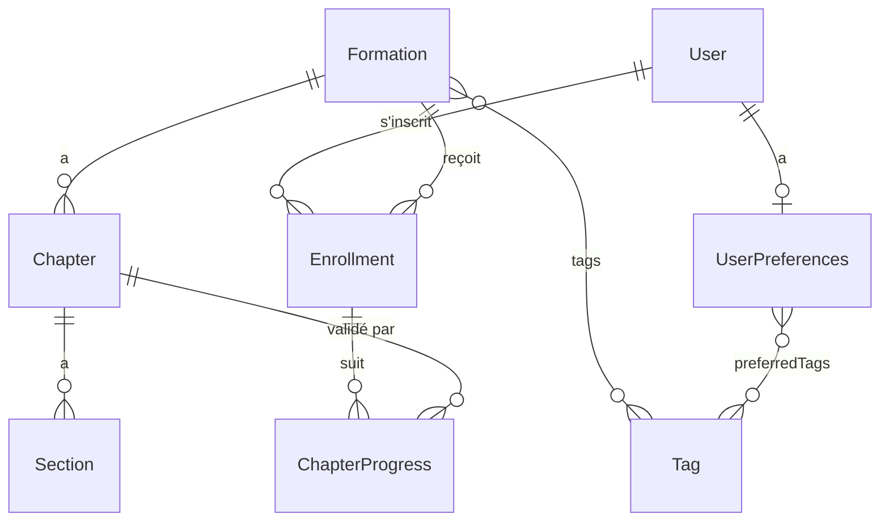

# Modèle de données

> **Statut** — Aligné sur le code (`src/Entity/`, `src/Enum/`). À garder synchronisé quand le modèle
> évolue. Le contexte d'origine vient des issues GitHub (contenu, parsing/sync, User, préférences,
> visibilité, progression) ; la source de vérité reste désormais les entités Doctrine.

## Vue d'ensemble

Le contenu pédagogique est écrit en **markdown** dans les dossiers de formation du dépôt parent.
La commande `app:formations:sync` (#9) l'importe en base. Le suivi utilisateur et les métadonnées
d'administration vivent uniquement en base et **ne sont jamais écrasés par la sync**.

On distingue trois groupes d'entités :

- **Contenu** — `Formation`, `Chapter`, `Section`, `Tag` (issue #7).
- **Comptes & préférences** — `User`, `UserPreferences` (issues #11, #14).
- **Progression** — `Enrollment`, `ChapterProgress` (issue #19).

## Énumérations

### `Visibility` (#18, #28)

Contrôle l'accès à une formation. Effet immédiat via le `FormationVoter` et le filtrage repository.

| Valeur     | Stocké    | Qui y accède              |
|------------|-----------|---------------------------|
| `DRAFT`    | `draft`   | Admin uniquement          |
| `BETA`     | `beta`    | Tout utilisateur connecté |
| `PUBLIC`   | `public`  | Tout le monde (anonyme compris) |

> La logique de visibilité vit à un seul endroit : `FormationVoter::voteOnAttribute()` (accès
> unitaire) et `FormationRepository::visibilitiesFor()` (filtrage des listes). Les deux donnent le
> même verdict. Détail dans [`securite-et-visibilite.md`](securite-et-visibilite.md).

### `Difficulty`

Niveau d'une formation, et préférence de niveau côté utilisateur. L'ordre (débutant < intermédiaire
< avancé) sert au bonus de proximité de niveau dans le score de recommandation.

| Valeur         | Stocké         | Libellé       |
|----------------|----------------|---------------|
| `BEGINNER`     | `beginner`     | Débutant      |
| `INTERMEDIATE` | `intermediate` | Intermédiaire |
| `ADVANCED`     | `advanced`     | Avancé        |

### `SectionType` (#8)

Type d'une section de chapitre, déduit du titre `##` par le `ChapterParser`.

Le mapping est une recherche de sous-chaîne sur le titre normalisé (sans accent, en minuscules),
faite par `ChapterParser::mapType()`. Un titre `##` qui ne correspond à rien tombe sur `CONTENT`.

| Valeur       | Reconnu si le titre `##` contient | Exemple de titre |
|--------------|-----------------------------------|------------------|
| `OBJECTIVES` | `objectif`                        | Objectifs        |
| `SUMMARY`    | `resume`                          | Résumé           |
| `EXERCISES`  | `exercice`                        | Exercices        |
| `QUIZ`       | `quiz`                            | Quiz             |
| `PROJECT`    | `projet`                          | Projet           |
| `CONTENT`    | (défaut, aucun mot-clé reconnu)   | Mise en place    |

### `Status`

Statut éditorial d'une formation, **distinct de `visibility`** : il décrit où en est la rédaction du
contenu, pas qui peut le voir. Réglé à la main depuis l'espace admin, jamais touché par la sync.

| Valeur  | Stocké  | Libellé    |
|---------|---------|------------|
| `DRAFT` | `draft` | Brouillon  |
| `DONE`  | `done`  | Terminé    |

## Entités de contenu (#7)

### `Formation`

Une formation = un dossier markdown du dépôt parent. La sync fait un **upsert par `slug`**.

| Champ              | Type                | Origine | Notes |
|--------------------|---------------------|---------|-------|
| `id`               | int                 | —       | PK    |
| `slug`             | string, **unique**  | sync    | Clé d'upsert (nom du dossier) |
| `title`            | string              | sync    | Titre H1 du `README.md` de la formation |
| `description`      | text                | sync    | Présentation : tout ce qui est entre le H1 et le premier `##`, rendu en HTML |
| `prerequisites`    | text, nullable      | sync    | Bloc « Prérequis » du README, rendu en HTML |
| `objectives`       | text, nullable      | sync    | Bloc « Ce que tu sauras faire », rendu en HTML |
| `project`          | text, nullable      | sync    | Bloc « Projet », rendu en HTML |
| `status`           | `Status`            | **admin** | Statut éditorial (défaut `DRAFT`) — distinct de `visibility` |
| `chapters`         | OneToMany `Chapter` | sync    | Ordonnés par `position` (`OrderBy` Doctrine) |
| `visibility`       | `Visibility`        | **admin** | Défaut `DRAFT`. Préservé par la sync |
| `difficulty`       | `Difficulty`, nullable | **admin** | Préservé par la sync |
| `tags`             | ManyToMany `Tag`    | **admin** | Préservé par la sync |
| `estimatedMinutes` | int, nullable       | **admin** | Préservé par la sync |
| `enrollments`      | OneToMany `Enrollment` | —    | Inscriptions reçues (signal de popularité) |
| `createdAt`        | datetime            | —       | Renseigné en `@PrePersist` |
| `updatedAt`        | datetime, nullable  | —       | Renseigné en `@PreUpdate` |

> Les trois blocs `prerequisites` / `objectives` / `project` sont découpés et rendus par le
> `ReadmeParser` (cf. [`synchronisation-contenu.md`](synchronisation-contenu.md)). Ce sont des
> champs **contenu** : ils sont donc réécrits à chaque sync, au même titre que `title` et
> `description`.

> **Invariant de sync (#9)** — `app:formations:sync` réécrit uniquement les champs **contenu**
> (`title`, `description`, `chapters`, `sections`…). Les champs **admin** (`visibility`,
> `difficulty`, `tags`, `estimatedMinutes`) ne sont jamais touchés. La commande est idempotente :
> la relancer ne duplique rien et préserve les réglages.

### `Chapter`

| Champ        | Type                 | Notes |
|--------------|----------------------|-------|
| `id`         | int                  | PK |
| `formation`  | ManyToOne `Formation`| |
| `position`   | int                  | Préfixe `NN-` du fichier `NN-slug.md` |
| `slug`       | string               | Partie `slug` du fichier `NN-slug.md`, clé d'upsert du chapitre |
| `title`      | string               | |
| `sections`   | OneToMany `Section`  | Ordonnées |

### `Section`

Découpe d'un chapitre par titre `##` (#8).

| Champ      | Type               | Notes |
|------------|--------------------|-------|
| `id`       | int                | PK |
| `chapter`  | ManyToOne `Chapter`| |
| `position` | int                | Ordre dans le chapitre |
| `type`     | `SectionType`      | Mappé depuis le titre `##` |
| `title`    | string             | |
| `content`  | text               | **HTML rendu** (CommonMark GFM) ; liens inter-chapitres réécrits vers les routes du lecteur par le `MarkdownRenderer` |

### `Tag`

| Champ   | Type               | Notes |
|---------|--------------------|-------|
| `id`    | int                | PK |
| `slug`  | string, **unique** | |
| `label` | string             | |

Relations : ManyToMany avec `Formation` (#7/#29) et avec `UserPreferences` (#14).

## Comptes & préférences

### `User` (#11)

| Champ         | Type               | Notes |
|---------------|--------------------|-------|
| `id`          | int                | PK |
| `email`       | string, **unique** | Identifiant de connexion |
| `password`    | string             | Hashé (`auto`, voir config `security`) |
| `roles`       | json               | `ROLE_USER` garanti par défaut ; `ROLE_ADMIN` ajouté à la main |
| `displayName` | string, nullable   | Éditable depuis la page profil |
| `preferences` | OneToOne `UserPreferences` | `cascade: persist, remove` |
| `enrollments` | OneToMany `Enrollment` | |

### `UserPreferences` (#14)

| Champ               | Type                  | Notes |
|---------------------|-----------------------|-------|
| `id`                | int                   | PK |
| `user`              | OneToOne `User`       | |
| `preferredTags`     | ManyToMany `Tag`      | Alimente le scoring de recommandation (#23) |
| `preferredDifficulty` | `Difficulty`        | |
| `weeklyGoalMinutes` | int, nullable         | Objectif hebdomadaire (minutes). Alimente le widget « Objectif de la semaine » du tableau de bord : les minutes accomplies depuis lundi sont estimées via `estimatedMinutes / nombre de chapitres` par chapitre terminé, ou via `ChapterProgressRepository::DEFAULT_CHAPTER_MINUTES` quand la formation n'a pas d'estimation (cas du contenu synchronisé, dont le champ admin reste null). Voir `ChapterProgressRepository::sumMinutesCompletedSince`. Widget masqué tant qu'aucun objectif n'est fixé. |

## Progression (#19)

### `Enrollment`

Inscription d'un utilisateur à une formation.

| Champ              | Type                  | Notes |
|--------------------|-----------------------|-------|
| `id`               | int                   | PK |
| `user`             | ManyToOne `User`      | |
| `formation`        | ManyToOne `Formation` | |
| `startedAt`        | datetime, nullable    | Date d'inscription |
| `lastActivityAt`   | datetime              | Mis à jour à chaque action de progression |
| `completedAt`      | datetime, nullable    | Run en cours terminé (tous les chapitres validés). **Remis à `null` par « Recommencer »** |
| `firstCompletedAt` | datetime, nullable    | Toute première complétion. Renseignée une fois, **jamais effacée** : trace d'historique |
| `completionCount`  | int (défaut 0)        | Nombre de complétions cumulées (étoiles). Incrémenté à chaque complétion, jamais remis à zéro |
| `chapterProgress`  | OneToMany `ChapterProgress` | `cascade: remove`, `orphanRemoval` |

> **Contrainte d'unicité** — `(user, formation)` : un utilisateur ne s'inscrit qu'une fois par
> formation.

> **Run en cours vs historique** — `completedAt` décrit l'état du run *actuel* (effacé par
> « Recommencer »), tandis que `firstCompletedAt` et `completionCount` décrivent l'historique
> *cumulé* (jamais effacés). Le détail du cycle inscription → progression → complétion → reprise
> est dans [`parcours-utilisateur.md`](parcours-utilisateur.md).

### `ChapterProgress`

| Champ         | Type                   | Notes |
|---------------|------------------------|-------|
| `id`          | int                    | PK |
| `enrollment`  | ManyToOne `Enrollment` | |
| `chapter`     | ManyToOne `Chapter`    | |
| `completedAt` | datetime               | Marqué « terminé » (#21) |

Le pourcentage d'avancement = `ChapterProgress` validés / total des `Chapter` de la formation
(calculé en SQL par `EnrollmentRepository::findWithProgressForUser()`, arrondi à l'entier).

## Voir aussi

- [`synchronisation-contenu.md`](synchronisation-contenu.md) — comment le markdown devient ces
  entités (commande de sync, parsers, rendu HTML).
- [`parcours-utilisateur.md`](parcours-utilisateur.md) — les flux qui écrivent dans `Enrollment` /
  `ChapterProgress`, le catalogue, les recommandations et l'espace admin.
- [`securite-et-visibilite.md`](securite-et-visibilite.md) — rôles, firewall, `FormationVoter` et
  filtrage par visibilité.
